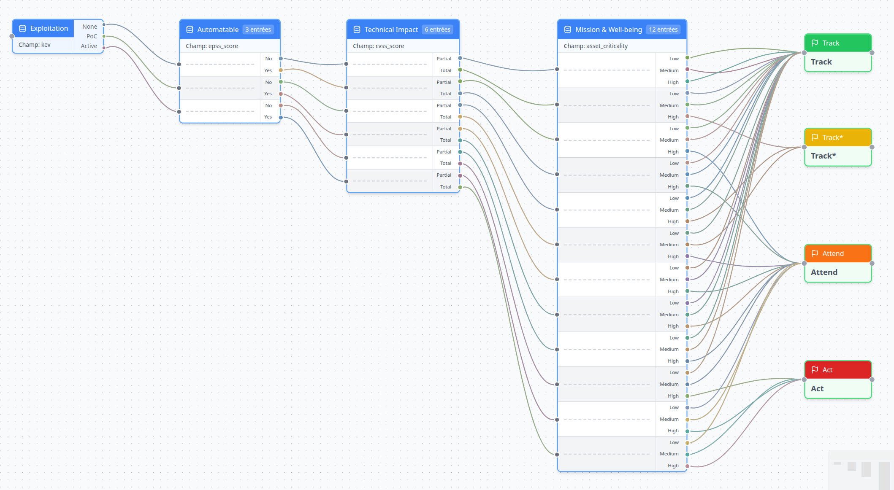
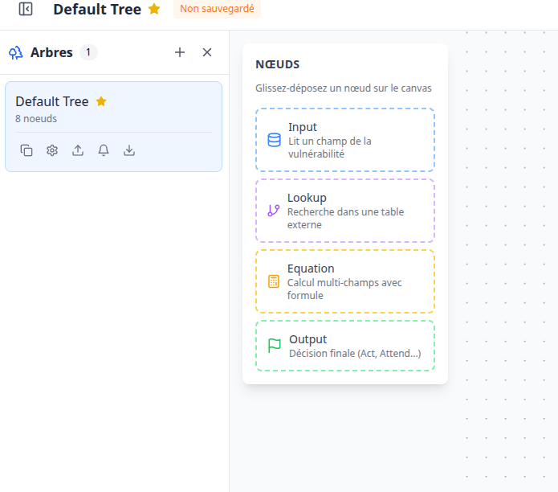
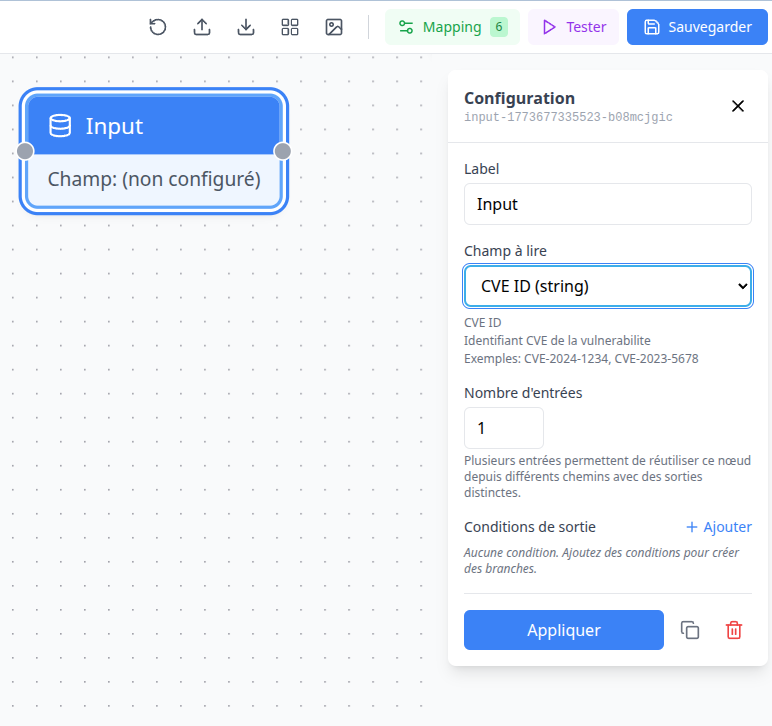
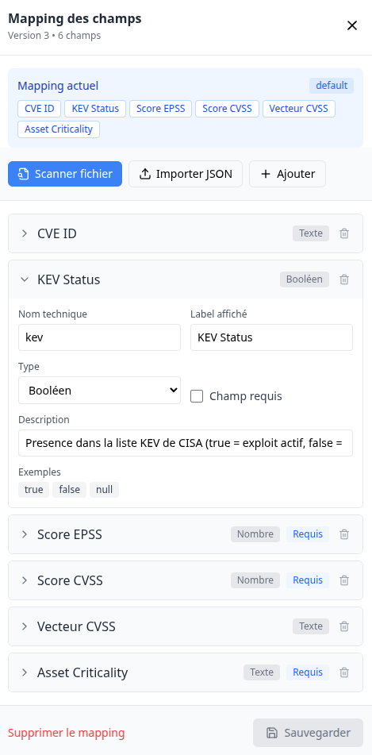
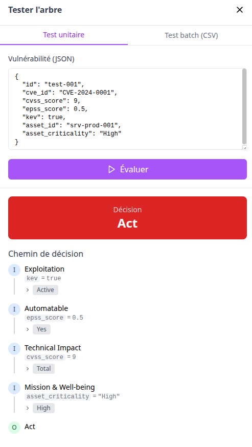

# TreeVuln — Security Decision Engine

[](LICENSE)
[](https://python.org)
[](https://fastapi.tiangolo.com)
[](https://react.dev)
[](docker-compose.yml)

Moteur de decision de securite visuel et auditable. Construisez graphiquement vos arbres de decision et utilisez-les pour automatiser le traitement de volumes massifs de vulnerabilites, non-conformites, audits cloud, containers et plus encore.



## Pourquoi TreeVuln ?

Les equipes securite croulent sous les alertes. Scanners de vulnerabilites, audits cloud, non-conformites, rapports containers — chaque outil produit des centaines de resultats, mais aucun ne dit **quoi faire en premier**.

TreeVuln vous permet de **dessiner votre propre logique de decision** sous forme d'arbre visuel, puis de l'appliquer automatiquement a des volumes massifs de donnees. Chaque decision est **transparente** (audit trail complet), **auditable** (exportable) et **personnalisable** (vos criteres, vos seuils, votre politique).

Que ce soit pour prioriser des CVE avec la methodologie SSVC, evaluer l'exploitabilite d'une vulnerabilite (VEX), trier des non-conformites cloud ou automatiser des controles d'audit — TreeVuln est le moteur qui transforme vos regles en decisions actionnables.

## Quick Start

```bash
git clone <repository-url> && cd TreeVuln
docker compose up -d
```

| Service | URL |
|---------|-----|
| Application | http://localhost:3000 |
| API | http://localhost:8000 |
| Documentation API (Swagger) | http://localhost:8000/docs |

<details>
<summary>Plus de captures d'ecran</summary>

| Palette de noeuds & sidebar | Configuration d'un noeud |
|:--:|:--:|
|  |  |

| Mapping des champs | Test & audit trail |
|:--:|:--:|
|  |  |

</details>

## Fonctionnalites

### Editeur visuel

- **Drag & drop** : 4 types de noeuds — Input, Lookup, Equation, Output
- **Conditions composees** : combinez plusieurs criteres avec AND/OR sur les branches
- **Noeuds multi-entrees** : mutualisez la logique pour optimiser les arbres complexes
- **Auto-layout** : reorganisez automatiquement les noeuds en un clic
- **Export image** : PNG ou SVG pour vos rapports et presentations

### Moteur d'inference

- **Evaluation unitaire et batch** : jusqu'a 50 000 elements par requete
- **Parsing CVSS** : extraction automatique des metriques CVSS v3.1 et v4.0
- **Noeud Equation** : formules mathematiques avec mapping texte-vers-nombre
- **Audit trail** : chemin de decision complet pour chaque evaluation

### Multi-arbres & API

- **Contextes isoles** : chaque arbre a ses propres assets, webhooks et endpoints
- **API dediee par arbre** : endpoint configurable via slug (`/evaluate/tree/mon-arbre`)
- **Decision-as-Code** : exportez/importez vos arbres en JSON pour les versionner dans Git
- **Versioning** : historique des modifications avec restauration

### Integration

- **Webhooks sortants** : notifications HMAC-SHA256 vers ticketing/SIEM
- **Webhooks entrants** : ingestion temps reel avec mapping de champs et cle API
- **Import/Export** : assets en CSV/JSON, resultats avec audit trail

## Cas d'usage

| Domaine | Exemple | Decisions typiques |
|---------|---------|-------------------|
| **Vulnerabilites** | Priorisation basee sur KEV, EPSS, CVSS et criticite des assets | Act, Attend, Track |
| **VEX** | Exploitabilite reelle d'une CVE dans le contexte du produit | Not Affected, Exploitable, In Triage |
| **Cloud** | Droits IAM excessifs, security groups ouverts, buckets exposes | Remedier, Accepter, Investiguer |
| **Containers** | Images Docker avec CVE, execution root, secrets en clair | Bloquer, Alerter, Ignorer |
| **Conformite** | Controles ISO 27001, SOC2, PCI-DSS | Conforme, Non-conforme, Exception |
| **Audit** | Evaluation de maturite, plan de remediation | Critique, A ameliorer, Conforme |

## Exemple API

Evaluation d'une vulnerabilite avec l'arbre SSVC par defaut (un des arbres fournis) :

```bash
curl -X POST 'http://localhost:8000/api/v1/evaluate/single' \
  -H 'Content-Type: application/json' \
  -d '{
    "vulnerability": {
      "cve_id": "CVE-2024-1234",
      "kev": true,
      "epss_score": 0.5,
      "cvss_score": 9.8,
      "asset_criticality": "High"
    }
  }'
```

```json
{
  "vuln_id": "CVE-2024-1234",
  "decision": "Act",
  "decision_color": "#dc2626",
  "path": [
    {
      "node_id": "exploitation",
      "node_label": "Exploitation",
      "field_evaluated": "kev",
      "value_found": true,
      "condition_matched": "Active"
    }
  ]
}
```

L'API complete est documentee sur [http://localhost:8000/docs](http://localhost:8000/docs) (Swagger UI).

## Stack technique

| Composant | Technologie |
|-----------|-------------|
| Frontend | React 18, TypeScript, React Flow, TailwindCSS, Zustand |
| Backend | FastAPI, Pydantic v2, Polars, SQLAlchemy 2.0 async |
| Base de donnees | PostgreSQL 15 (JSONB) |
| Deploiement | Docker Compose |

## Editions

### Community (gratuit, AGPL-3.0)

Tout ce dont vous avez besoin pour construire et executer vos arbres de decision :

- Editeur visuel complet avec drag & drop
- Moteur d'inference (unitaire, batch, CSV)
- Multi-arbres, webhooks, ingestion
- Decision-as-Code (export/import JSON)
- Auto-layout et export image (PNG/SVG)
- Parsing CVSS v3.1 et v4.0, audit trail

### Enterprise (licence commerciale)

Pour les equipes qui ont besoin de gouvernance, d'integrations et de reporting :

- SSO (SAML / OIDC) et RBAC (roles granulaires)
- Visual Diff entre versions d'arbres
- Connecteurs natifs (Tenable, Qualys, Jira, ServiceNow)
- Noeuds specialises (Threat Intel, CMDB externe)
- Audit trail avance (certificats de decision PDF/JSON)
- Reporting multi-arbres et simulation What-if

Pour obtenir une licence Enterprise, contactez-nous via les issues du repository.

## Developpement

```bash
# Backend
cd backend && pip install -e . && uvicorn app.main:app --reload --port 8000

# Frontend
cd frontend && npm install && npm run dev

# Tests
cd backend && python -m pytest tests/ -v
cd frontend && npm test
```

<details>
<summary>Commandes Docker utiles</summary>

```bash
docker compose up -d              # Demarrer
docker compose down               # Arreter
docker compose down -v            # Arreter + supprimer les donnees
docker compose up -d --build      # Reconstruire
docker compose logs -f backend    # Logs backend
```

</details>

## Licence

Le code source de TreeVuln Community est sous licence [GNU Affero General Public License v3.0 (AGPL-3.0)](LICENSE).

Les modules Enterprise sont sous licence commerciale separee.

## Contribuer

Les contributions sont les bienvenues. Pour signaler un bug ou proposer une fonctionnalite, ouvrez une issue sur le repository.
