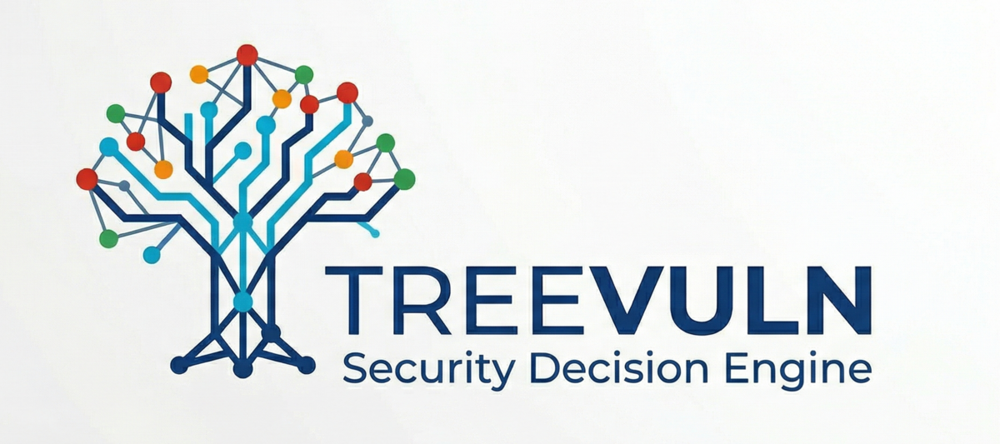
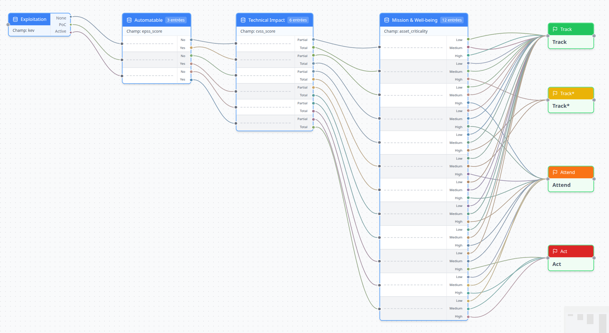
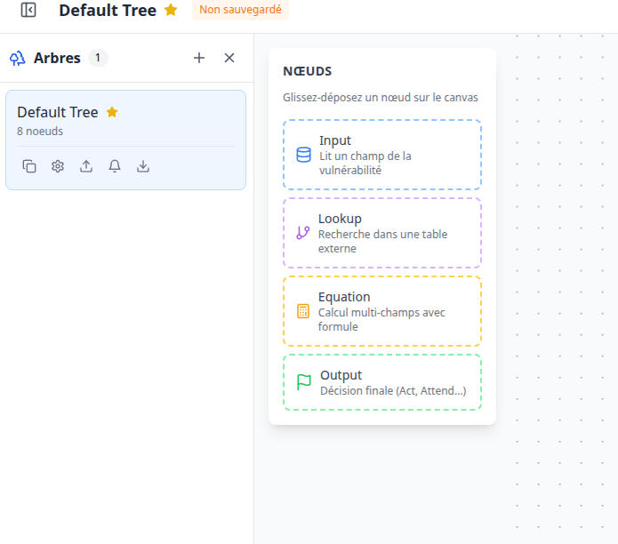
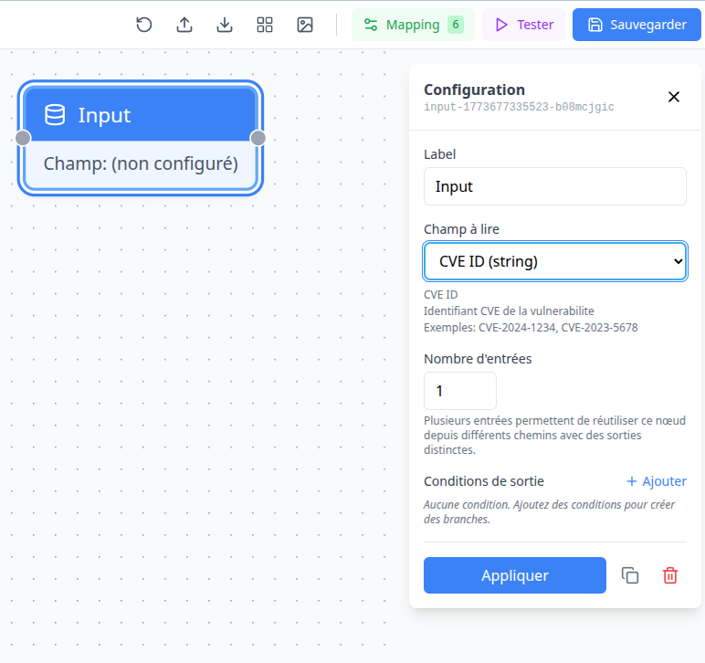
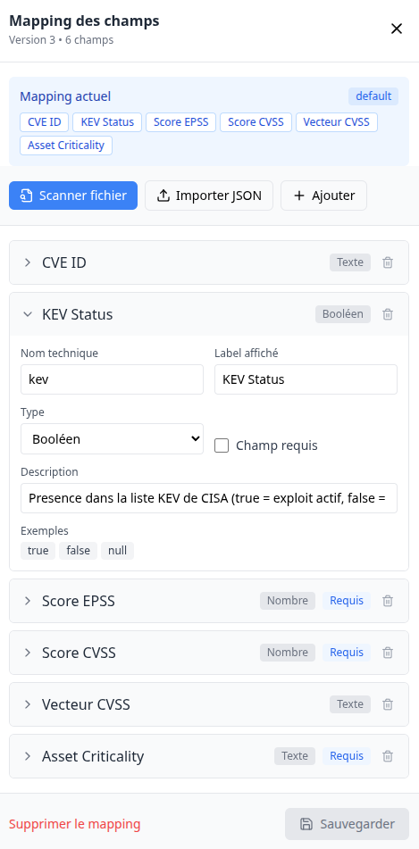
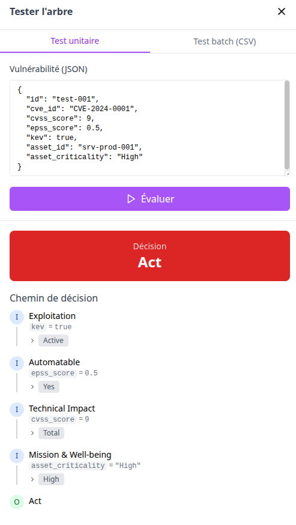

<p align="center">
  
</p>

<p align="center">
  <a href="LICENSE"></a>
  <a href="https://python.org"></a>
  <a href="https://fastapi.tiangolo.com"></a>
  <a href="https://react.dev"></a>
  <a href="docs/deployment.md"></a>
</p>

**TreeVuln is a visual, auditable security decision engine.** Design your decision logic as a graphical tree, then let it process massive volumes of security findings — vulnerabilities, cloud misconfigurations, container reports, compliance checks — and tell you exactly **what to act on first, and why**.



## Why TreeVuln?

Security teams are drowning in alerts. Vulnerability scanners, cloud audits, compliance checks, container reports — every tool produces hundreds of results, but none tells you **what to act on first**.

TreeVuln turns your prioritization policy into an executable decision tree:

- **Transparent** — every decision comes with its full audit trail: which criteria were evaluated, which values were found, which branch was taken.
- **Auditable** — decision paths are exportable, and results can be turned into signed, standards-compliant documents (CSAF 2.0 VEX).
- **Yours** — your criteria, your thresholds, your policy. SSVC out of the box, anything you want beyond it.

Whether you prioritize CVEs with SSVC, assess real exploitability in your product context (VEX), triage cloud findings, or automate audit controls — TreeVuln is the engine that turns your rules into decisions at scale.

## Features

### Design your logic visually

Build trees by drag & drop with four node types — **Input** (read a field), **Lookup** (enrich from a referential, e.g. asset criticality), **Equation** (mathematical scoring with text-to-number mapping) and **Output** (final decision). Branches support simple conditions or compound AND/OR logic across multiple fields, multi-input nodes let several paths share the same logic, and one-click auto-layout keeps large trees readable. Export any tree as PNG/SVG for your reports.



Each node is configured in place: field to read, operators (=, ≠, >, <, contains, regex, in, is_null…), typed values (text, number, boolean), branch reordering.



### Feed it any data

Point TreeVuln at a CSV or JSON file and it scans the columns, infers types, and builds a **field mapping** you can refine and version. CVSS v3.1/v4.0 vectors are parsed automatically into individual metrics (`cvss_av`, `cvss_ac`, …) usable as decision criteria.



### Decide at scale, with proof

Evaluate a single finding or batches up to 50,000 items per request (Polars-powered). Every evaluation returns the **complete decision path** — the built-in test panel replays it visually, and batch results export to CSV/JSON with the audit trail included.



### Run several trees, expose them as APIs

Each tree lives in its own context: dedicated assets, webhooks and ingest endpoints. Any tree can expose its own evaluation API via a slug (`/api/v1/evaluate/tree/my-tree`). Trees are versioned (history + restore) and exportable as JSON — **Decision-as-Code**, ready for Git.

### Integrate both ways

- **Inbound**: real-time ingestion endpoints with API keys and per-endpoint field mapping; findings are auto-evaluated on arrival.
- **Outbound**: HMAC-SHA256 signed webhooks notify your ticketing or SIEM on every decision.
- **SBOM-aware**: attach a CycloneDX or SPDX SBOM to each asset and use `sbom_*` virtual fields (component present, version, match type) directly in your trees — prioritize only the CVEs whose vulnerable component actually ships in your product.

### Prove compliance

- **CSAF 2.0 VEX export**: batch results become a standard CSAF document (validated against the official OASIS schema), with VEX statuses and justifications carried by output nodes and each statement embedding its TreeVuln decision path as evidence.
- **OpenPGP signing**: detached signature plus SHA-256/512 checksums, delivered as a ZIP bundle ready for regulators and coordinators.
- **CRA / ENISA deadline tracking**: flag decisions as notifiable, track the 24h / 72h / 14-day deadlines, prefill each milestone's content (JSON/Markdown) and get webhook reminders before deadlines slip.

### Control who does what

Multi-user authentication (bcrypt, server-side sessions in PostgreSQL) with two roles — **admin** (full access) and **operator** (read + evaluate) — and a first-launch setup wizard: no default credentials, ever.

## Use Cases

| Domain | Example | Typical Decisions |
|--------|---------|-------------------|
| **Vulnerabilities** | Prioritization based on KEV, EPSS, CVSS, and asset criticality | Act, Attend, Track |
| **VEX** | Actual exploitability of a CVE in the product context, exported as signed CSAF 2.0 | not_affected, affected, fixed, under_investigation |
| **SBOM / Supply chain** | Prioritize only CVEs whose affected component is actually present in the asset's SBOM | Act, Attend, Track |
| **CRA notification** | Track regulatory deadlines for actively-exploited vulnerabilities flagged as notifiable | Early warning (24h), Notification (72h), Final report (14d) |
| **Cloud** | Excessive IAM permissions, open security groups, exposed buckets | Remediate, Accept, Investigate |
| **Containers** | Docker images with CVEs, root execution, plaintext secrets | Block, Alert, Ignore |
| **Compliance** | ISO 27001, SOC2, PCI-DSS controls | Compliant, Non-compliant, Exception |
| **Audit** | Maturity assessment, remediation plan | Critical, Needs Improvement, Compliant |

Three example trees ship with every install: **SSVC Example** (CVE prioritization), **Equation Example** (formula-based risk scoring) and **CSAF VEX Example** (VEX triage for CSAF export).

## Quick Start

```bash
git clone <repository-url> && cd TreeVuln
cp .env.example .env    # set POSTGRES_PASSWORD (see the guide)
docker compose up -d
```

Open http://localhost:3000 and create your admin account. That's it.

For configuration, production hardening, local development and troubleshooting, see the **[Deployment Guide](docs/deployment.md)**.

## API Example

Everything the UI does goes through the REST API. Authenticate, then evaluate:

```bash
# Login (stores session cookie)
curl -c cookies.txt -X POST 'http://localhost:8000/api/v1/auth/login' \
  -H 'Content-Type: application/json' \
  -d '{"username": "admin", "password": "yourpassword"}'

# Evaluate a vulnerability against the default SSVC tree
curl -b cookies.txt -X POST 'http://localhost:8000/api/v1/evaluate/single' \
  -H 'Content-Type: application/json' \
  -d '{
    "vulnerability": {
      "cve_id": "CVE-2024-1234",
      "kev": true,
      "epss_score": 0.5,
      "cvss_score": 9.8,
      "asset_criticality": "High"
    }
  }'
```

```json
{
  "vuln_id": "CVE-2024-1234",
  "decision": "Act",
  "decision_color": "#dc2626",
  "path": [
    {
      "node_id": "exploitation",
      "node_label": "Exploitation",
      "field_evaluated": "kev",
      "value_found": true,
      "condition_matched": "Active"
    }
  ]
}
```

Interactive API documentation (Swagger UI) is available at `http://localhost:8000/docs` when `DEBUG=true`.

## Tech Stack

| Component | Technology |
|-----------|------------|
| Frontend | React 18, TypeScript, React Flow, TailwindCSS, Zustand |
| Backend | FastAPI, Pydantic v2, Polars, SQLAlchemy 2.0 async |
| Database | PostgreSQL 15 (JSONB) |
| Deployment | Docker Compose |

## Documentation

- **[Deployment Guide](docs/deployment.md)** — installation, configuration, production notes, local development

## License

TreeVuln is licensed under the [GNU Affero General Public License v3.0 (AGPL-3.0)](LICENSE). A [commercial license](LICENSE-COMMERCIAL.md) is available for enterprise use cases not compatible with the AGPL.

## Contributing

Contributions are welcome. To report a bug or suggest a feature, open an issue on the repository.
